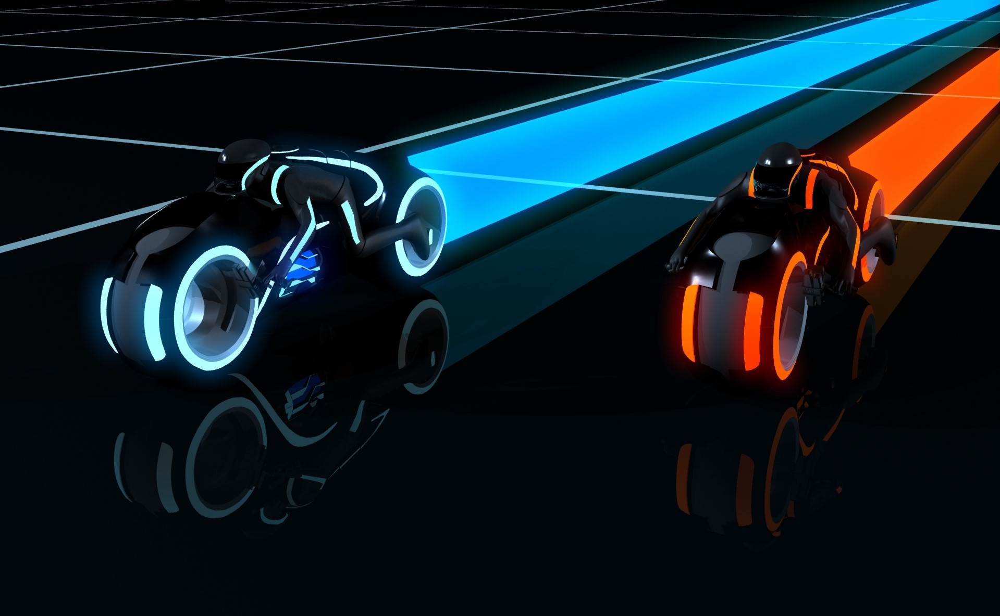
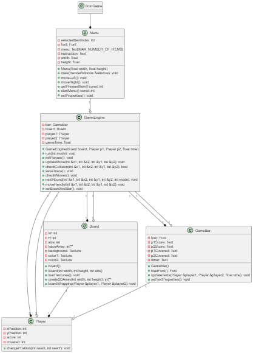

¡Bienvenido a Tron, el juego de las motos de luz!

En este emocionante juego, te conviertes en una moto de luz que deja rastros brillantes a su paso. Tu objetivo es moverte por la pantalla y dejar un rastro sin chocar contra las paredes ni contra el rastro del otro jugador.

Instrucciones:
Para ejecutar el juego abre una terminal y escribe "Make run" y disfruta del juego 

Al iniciar el juego entrarás al menú y elige el tipo de juego
El covered mode es lento y gana el que tenga mas wins despues de 40 segundos
El classic mode es rapido igual que el arcade clasico

Utiliza las teclas de dirección para cambiar de dirección y evitar obstáculos.
¡Cuidado!  contra el rastro que deja el otro jugador cuando tocas las orillas del la ventana apareceras en el lado contrario.

El jugador 1 de color naranja se moverá con las teclas:
w - Arriba
s - Abajo
d - Derecha
a - Izquierda

El jugador 2 de color azúl se moverá con las teclas:
^ - Arriba
 - Abajo
> - Derecha
< - Izquierda

Puntuación:

El juego llevará un conteo del puntaje de ambos jugadores en la parte superior.
El juego se repetirá al infinito hasta que te cnases de ganar!!! 
Solo cierra el juego para salir
¡Disfruta de Tron y demuestra quién es el maestro de las motos de luz

DiagramaPlantUML.png

Autores:
Braulio Santiago Altamirano López 22310243

Joaquin Monroy Navarro 22310267

